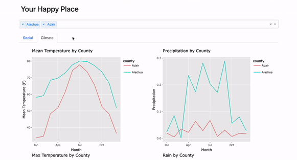

# Your Happy Place!

Welcome to Your Happy Place - YHP!

Are you at the crossroads of your life?

Are you done with a chapter of your life - beautiful or trying as it was - and ready for your next adventure?

We are here for you!

At Your Happy Place, you will be able to find your next base according to your very own preferences. Compare weather, schools, healthcare, cost of living and more among over 8,000 US counties!

The dashboard below is the weather app component of YHP. Check it out on Heroku:
https://your-happy-place-r.herokuapp.com/

1. On the top of the display you will notice a 'county' box, you begin by selecting all the US counties you would like to start comparing. When doing this you will notice a list of the counties you are selecting begin to appear.

2. Below the selector you will see many generated graphs for categories that include: Percentage unemployed, Mean Monthly Temperature, Mean Monthly Precipitation, Minimum monthly temperature, Mean monthly rainfall, Max monthly temperature, Mean monthly Snowfall, Population density, and the list goes on! You can then use these plots to compare the cities you have selected above.

3. You may remove counties by clicking "x" in the selector section.

4. Feel free to navigate between the tabs and hover over the graphs to get more information!

Its just that simple!

License
-------
The materials are licensed under the terms of the MIT license (Copyright (c) 2022 Master of Data Science at the University of British Columbia). See [here](https://github.com/UBC-MDS/mental_health_in_tech_dashboard/blob/main/LICENSE) for details.
